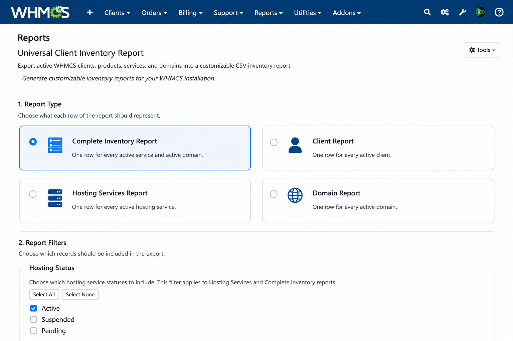

# Universal Client Inventory Report (UCIR)

> A free and open-source reporting framework for WHMCS.

*Developed by Cortez Web Services*

---

## Overview

The **Universal Client Inventory Report (UCIR)** is a flexible reporting framework designed specifically for WHMCS.

WHMCS stores an incredible amount of valuable information about clients, hosting services, domains, billing, and infrastructure. While WHMCS includes several built-in reports, administrators often need reports tailored to their own workflows and business requirements.

UCIR was created to solve that problem.

Instead of limiting administrators to predefined reports, UCIR provides a flexible reporting engine that allows users to decide:

- What information to include
- Which records should be displayed
- How information is filtered
- How reports are organized
- How reports are exported

The long-term goal is to provide one reporting framework capable of producing virtually any inventory-based report within WHMCS.

---

# Why UCIR?

UCIR is built around a simple philosophy:

> **Administrators should be able to build reports around the information they need rather than being limited to predefined reports.**

The project emphasizes:

- Simplicity
- Flexibility
- Reliability
- Maintainability
- Extensibility
- Professional user experience

---

# Current Features

## Report Types

- Complete Inventory Report
- Client Report
- Hosting Services Report
- Domain Report

## Field Selection

Choose exactly which information appears in your report.

Examples include:

- Client Information
- Hosting Information
- Domain Information
- Client Summary Information

## Intelligent Filtering

Current filters include:

- Hosting Status
- Domain Status

The interface automatically displays only the filters applicable to the selected report.

## Conditional User Interface

UCIR dynamically adapts its interface based on the selected report type.

Only the filters and report fields relevant to the current report are displayed.

## CSV Export

Generate reports in CSV format for use with Excel, LibreOffice, Google Sheets, or other spreadsheet software.

CSV filenames are automatically generated based on the selected report type.

## Modular Architecture

UCIR separates functionality into independent components including:

- HTML Interface
- Query Engine
- Data Mapper
- Field Definitions
- Export Engine

This architecture makes UCIR easier to maintain while providing a solid foundation for future enhancements.

---

# Planned Features

The UCIR roadmap currently includes:

### Export Formats

- Microsoft Excel (.xlsx)
- PDF
- JSON
- XML

### Additional Filtering

- Product
- Server
- Registrar
- Billing Cycle
- Date Range

### Reporting Features

- Advanced Sorting
- Saved Report Profiles
- Scheduled Reports
- Email Delivery
- Additional Inventory Modules

### Developer Features

- Extension Points
- Plugin Architecture
- Additional Report Modules

---

# Requirements

- WHMCS 8.x
- PHP version supported by your WHMCS installation
- Administrator access

---

## Installation

1. Download the latest UCIR release.
2. Copy the `modules/addons/ucir` directory into your WHMCS installation under:

   `modules/addons/`

3. Verify the final installation path is:

   `modules/addons/ucir/`

4. Open the UCIR report from the WHMCS administrator area.

5. Run the built-in database diagnostic before generating your first report.

As with any third-party module, it is recommended that you back up your WHMCS installation and database before installing or upgrading.

---

# Project Status

UCIR is under active development.

The reporting engine is stable and functional, with additional capabilities actively being developed.

---

# Contributing

Community participation is encouraged.

You can help by:

- Reporting bugs
- Suggesting new features
- Improving documentation
- Testing new releases
- Contributing code

Please use GitHub Issues and Discussions to participate.

---

# Support UCIR

UCIR will always remain free and open source.

If UCIR saves you time or helps your business, voluntary donations help support continued development, testing, and documentation.

Additional information about supporting the project will be available on the official project website.

---

# Roadmap

The complete project roadmap is maintained in:

**ROADMAP.md**

---

# Changelog

Release history is maintained in:

**CHANGELOG.md**

---

# Credits

## Project Author

**Douglas LaMunyon**

## Organization

**Cortez Web Services**

https://cortezweb.com

---

## License

UCIR is released under the MIT License.

The project is intended to remain free and open source to encourage adoption, collaboration, and community-driven improvements.

---

Thank you for your interest in UCIR.

Our goal is to provide the WHMCS community with a powerful, flexible, and completely free reporting framework that continues to grow through community feedback and collaboration.
